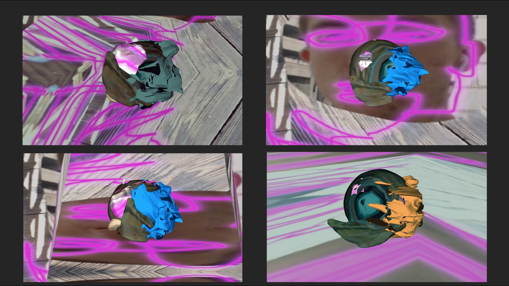

# 3D Object Display

## A facetracking 3D model viewer built in OpenFrameworks

Requires [OpenFrameworks](https://github.com/openframeworks/openFrameworks) with the [ofxCv](https://github.com/kylemcdonald/ofxCv), and [ofxFaceTracker](https://github.com/kylemcdonald/ofxFaceTracker) addons.

